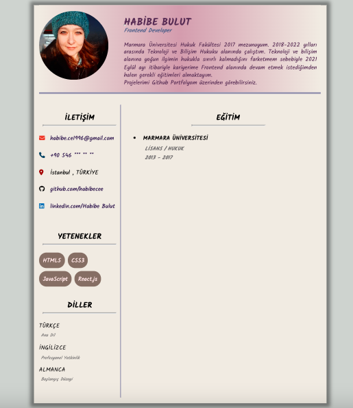
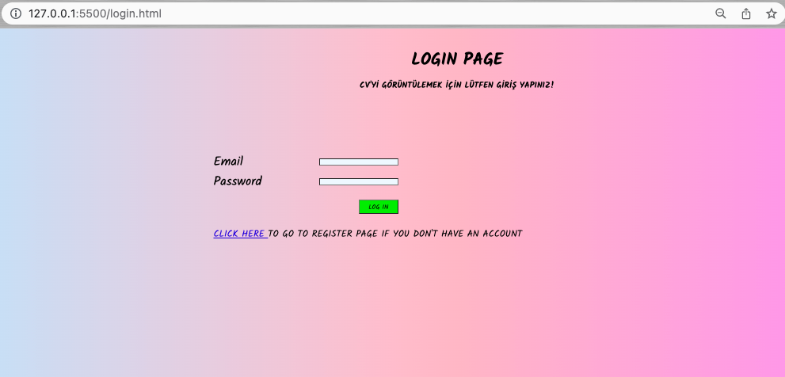
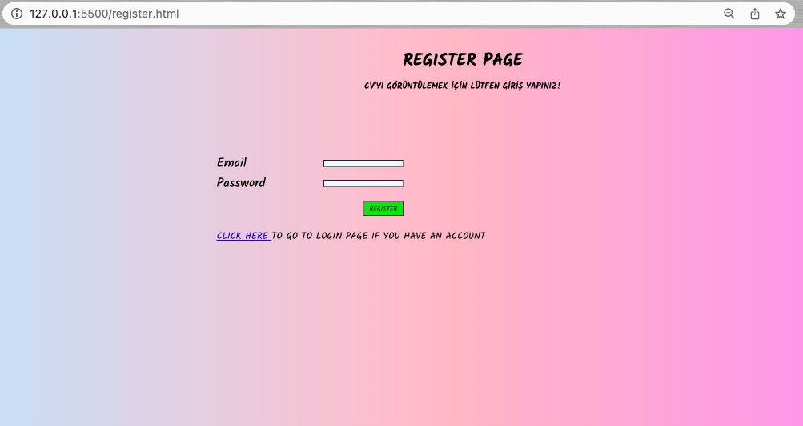

<h1>  MY STATIC CV  </h1>  

 Dil desteği için kütüphane oluşturulacak ve Backend'e gönderilen isteklerin karşılanması hususunda kontroller yapılacaktır. 
  

<h4> CV </h4>  

  

<h4> LOGIN VE REGISTER SAYFALARI </h4>  

  
  

<h4> CV GIF </h4>  

